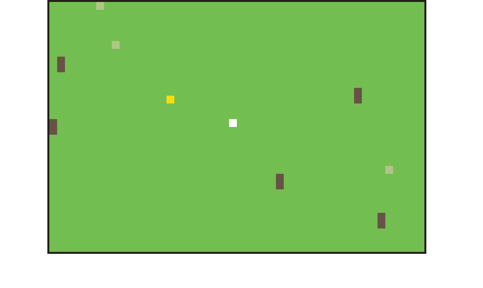

# Quadtree Demo

This demo uses quadtrees to select only the cows, goblins, and NPCs that are within the relatively small viewport. It then renders them on an HTML canvas. A simple game loop updates the positions of the creatures every 600ms.

# Link

To view the demo, head [here](http://zubry.github.io/quadtrees/)

# About

Light green tiles are goblins, 2x1 brown tiles are cows, the yellow tile is Hans, and the white tile is the player.

Each creature is bounded by a certain sized box. If they reach the edge of the box, they will reverse direction.

Movement is determined by randomly selecting an integer between -1 and 1 for each direction and adding that amount to the current position. While not something I would use in production, it works fine for demo purposes.
